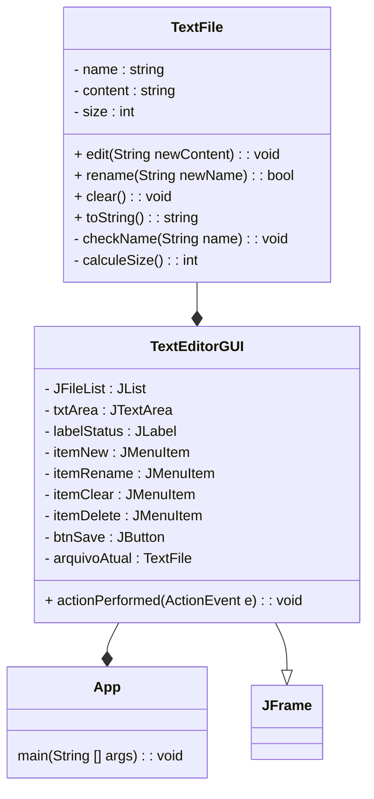

---
# Mini projeto: Editor de texto (Básico)
Profº.: Cainã Antunes Silva  
Tecnólogo em Análise e Desenvolvimento de Sistemas (ADS)

---

> O objetivo deste mini projeto é criar um editor de texto simple, colocando em prática os conceitos demonstrados em aula como estrutura básica de classes Java, encapsulamento, recursos da classe String e excessões. 

O projeto apresenta uma interface gráfica simples (`TextEditorGUI`), que é composta por:
* **Barra de menu:** entitulada *"Arquivo"* (`JMenuBar`), permite que o usuário escolha entre as operações *"Novo"*, *"Renomear"* ,*"Limpar"* ou *"Deletar"* um arquivo.  
* **Painel lateral:** apresenta a lista de arquivos de texto criados durante a execução da aplicação, permitindo que o usuário os selecione para inspeção/edição.
* **Painel central:** Possui um `JTextArea`, para inspeção/edição do conteúdo dos arquivos de texto, e um botão para *Savar* as alterações.
* **Barra de status:** Apresenta o nome e o tamanho (em bytes) do arquivo selecionado.

---

### Diagrama de classes:

---
### Tarefa:

* Implementar a classe `TextFile` conforme diagrama de classes e as regras a seguir:
    * O método `toString()` deve retornar apenas os campos `name` e `size`.
    * O método `checkName(String name)` deve eliminar espaços em branco do início ou fim do nome do arquivo, além de remover qualquer caracter especial. 
    * O atributo `name`, não pode ser nulo ou estar em branco, uma exceção deve ser lançada neste caso.  
    * O tamanho do arquivo é dado em bytes e é proporcional ao número de caracteres do seu conteúdo, sendo que 1 byte = 1 caracter.

---
## Extra: Criar Interfaces com `javax.swing`

O `javax.swing` é uma biblioteca para criar interfaces gráficas Desktop em Java. Ela possui total controle sobre a renderização, permitindo que a janela tenha o mesmo design independente do sistema operacional.

Veja a seguir alguns componentes disponibiliza pela bilbioteca: 

| Componente | Função no Projeto | Principais Métodos |
| :--- | :--- | :--- |
| **JFrame** | Janela principal que agrupa e exibe todos os outros elementos. | `setSize()`, `setVisible()`, `setDefaultCloseOperation()` |
| **JTextField** | Caixa de entrada de texto onde o usuário digita o número. | `getText()`, `setText()`, `setHorizontalAlignment()` |
| **JLabel** | Rótulo de texto estático usado para exibir os resultados. | `setText()`, `getText()` |
| **JButton** | Botão que age como gatilho para executar a conversão. | `addActionListener()`, `doClick()` |
| **JComboBox** | Lista suspensa usada para escolher as escalas. | `getSelectedItem()`, `setSelectedItem()` |

> ### A mecânica dos Eventos: `ActionListener` e `ActionEvent`
> O Java trabalha com a Orientação a Eventos utilizando "ouvintes". O `ActionListener` atua como um radar conectado a um componente (como o `JButton`). Quando o botão é clicado, o Java empacota todas as informações desse clique em um objeto chamado `ActionEvent` e o envia. O ouvinte captura essa "mensagem" instantaneamente através do método `actionPerformed` e executa a ação contida em sua implementação.

***